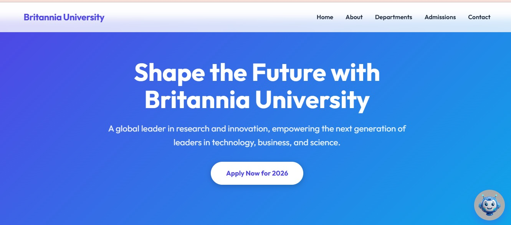
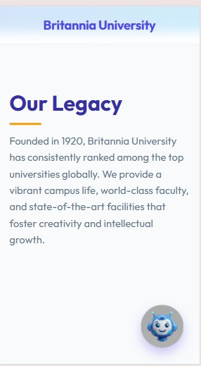
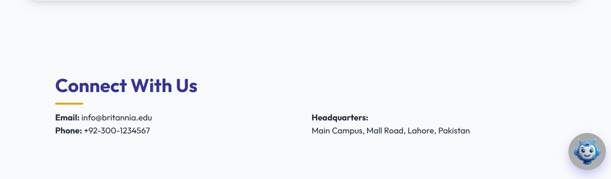
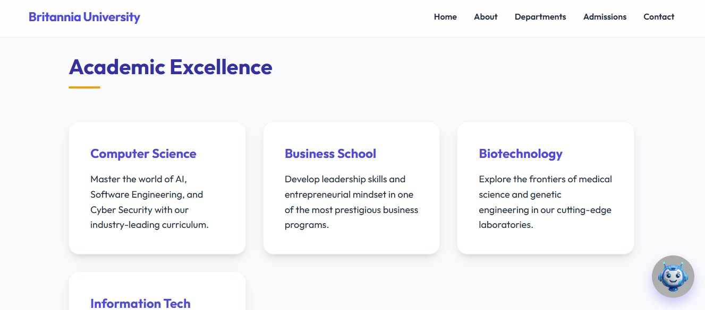

<div align="center">


# 🎓 BritanniaBot — Automatic University AI Chatbot

### An intelligent, LLM-powered virtual assistant for university websites — built with Flask, Groq, and Llama 3.3 70B

<em>Ask about admissions, scholarships, departments, and campus life — get instant, on-topic answers, 24/7.</em>

<!-- Badges -->


<!-- Demo GIF Placeholder -->


<br/><br/>

[](https://www.loom.com/share/a13874dfabe740f1aeda9065e84ba28f)
[](https://automatic-university-chatbot.onrender.com/)

</div>

---

## 📚 Table of Contents

- [Overview](#-overview)
- [Features](#-features)
- [Demo](#-demo)
- [Screenshots](#-screenshots)
- [Project Architecture](#-project-architecture)
- [Folder Structure](#-folder-structure)
- [AI Pipeline](#-ai-pipeline)
- [Model Details](#-model-details)
- [Prompt Engineering & Guardrails](#-prompt-engineering--guardrails)
- [Installation](#-installation)
- [Usage](#-usage)
- [Deployment](#-deployment)
- [API Endpoints](#-api-endpoints)
- [Technologies Used](#-technologies-used)
- [Performance](#-performance)
- [Future Improvements](#-future-improvements)
- [Contributing](#-contributing)
- [License](#-license)
- [Contact](#-contact)

---

## 🧭 Overview

Prospective students, parents, and staff visiting a university website usually have dozens of repetitive questions — *"When do admissions open?"*, *"What scholarships are available?"*, *"How do I contact the CS department?"* Answering these manually, or forcing visitors to dig through static pages, creates friction and lost leads.

**BritanniaBot** solves this by embedding a conversational AI assistant directly into the university's website. Powered by **Meta's Llama 3.3 70B** model served through the ultra-low-latency **Groq Inference API**, the chatbot answers admissions, academic, and campus-related questions instantly, in natural language, around the clock.

> [!TIP]
> Unlike generic chatbots, BritanniaBot is **domain-locked** via a carefully engineered system prompt — it only discusses Britannia University topics and politely declines everything else, keeping the assistant on-brand and on-topic.

**Why this project matters:**
- 🕐 Reduces admissions office workload by automating FAQ-style queries
- ⚡ Sub-second responses thanks to Groq's LPU inference engine
- 🎯 Domain-restricted responses prevent off-topic or hallucinated answers
- 🖥️ Fully self-contained: a single Flask backend + vanilla JS widget, easy to embed anywhere

---

## ✨ Features

| Feature | Description |
|---|---|
| 💬 Floating Chat Widget | Non-intrusive, expandable chat bubble embedded on every page |
| 🤖 LLM-Powered Answers | Responses generated by Llama 3.3 70B via the Groq API |
| 🎯 Domain-Restricted Persona | System prompt confines the bot strictly to university-related topics |
| ⚡ Real-Time Typing Indicator | Animated "..." bubble while the AI generates a response |
| 🎨 Modern Responsive UI | Glassmorphism navbar, gradient hero, and mobile-friendly layout |
| 🔐 Environment-Based Secrets | API keys managed securely via `.env` and `python-dotenv` |
| 🌐 CORS-Enabled API | Flask-CORS configured for safe cross-origin requests |
| 🧩 Zero-Dependency Frontend | Pure HTML/CSS/JS — no frameworks, no build step required |
| 🧪 Environment Health Check | `test_env.py` script verifies API connectivity before deployment |
| 📱 Mobile-Optimized Chat | Full-screen chat experience automatically on smaller viewports |

---

## 🎬 Demo

| Resource | Link |
|---|---|
| 🎥 Loom Walkthrough | [Watch the demo](https://www.loom.com/share/a13874dfabe740f1aeda9065e84ba28f) |
| 🌐 Live Website | [Visit live demo](https://automatic-university-chatbot.onrender.com/) |
| 🖼️ Screenshots | See [Screenshots](#-screenshots) below |

---

## 🖼️ Screenshots

<div align="center">

| Homepage 
|---|---|
| 

Mobile View |
|---|---|
|  
| About 
|---|---|
|  

| Department Example 
|---|---|
| 

</div>

> [!NOTE]
> Screenshot placeholders above — replace the files in `./assets/` with real captures before publishing.

---

## 🏗️ Project Architecture

```
┌──────────────────────┐        HTTPS / JSON        ┌───────────────────────┐
│   Frontend (Client)  │  ─────────────────────────▶ │   Flask Backend       │
│  index.html / CSS /  │                              │   (app.py)            │
│  chatbot.js          │  ◀───────────────────────── │                        │
└──────────────────────┘        Bot reply (JSON)      └───────────┬───────────┘
                                                                    │
                                                                    │ Groq SDK call
                                                                    ▼
                                                        ┌───────────────────────┐
                                                        │   Groq Cloud API      │
                                                        │  Llama 3.3 70B Model  │
                                                        └───────────────────────┘
```

The frontend is a static single-page site served directly by Flask. When a visitor sends a message, `chatbot.js` performs a `fetch()` POST request to the `/chat` endpoint. Flask injects a fixed **system prompt** ahead of the user's message, forwards the conversation to the Groq-hosted Llama 3.3 70B model, and streams the model's reply back to the browser as JSON.

---

## 📁 Folder Structure

```
Automatic-University-Chatbot/
│
├── app.py               # Flask backend — routes, Groq client, system prompt, /chat endpoint
├── test_env.py           # Standalone script to verify GROQ_API_KEY connectivity
├── index.html             # University website markup + embedded chat widget
├── style.css               # Global styles, hero section, chat widget UI
├── chatbot.js                # Client-side chat logic (fetch calls, DOM updates)
├── bot-icon.png                # Chat launcher icon
├── requirements.txt              # Python dependencies
├── .env                            # GROQ_API_KEY (not committed — see .gitignore)
├── .gitignore                        # Excludes .env, venv/, __pycache__/, etc.
└── README.md                           # You are here
```

---

## 🔄 AI Pipeline

```
User types a question
        ↓
chatbot.js sends POST /chat
        ↓
Flask receives request & extracts message
        ↓
System prompt + user message assembled
        ↓
Groq API call → Llama 3.3 70B (temperature = 0)
        ↓
Model generates domain-constrained reply
        ↓
Flask returns JSON { "reply": "..." }
        ↓
chatbot.js renders bot bubble in chat window
```

---

## 🧠 Model Details

| Attribute | Value |
|---|---|
| Model | `llama-3.3-70b-versatile` |
| Provider | [Groq Cloud](https://groq.com) (LPU-accelerated inference) |
| Type | Instruction-tuned Large Language Model (no fine-tuning / no local training) |
| Temperature | `0` (deterministic, factual responses) |
| Context Strategy | Single system prompt + single user turn per request (stateless) |
| Latency | Near-instant responses thanks to Groq's inference hardware |

> [!NOTE]
> BritanniaBot does **not** train or fine-tune a custom model. It uses **prompt engineering** to constrain a general-purpose LLM to a specific domain — a lightweight, cost-effective alternative to fine-tuning for narrow, FAQ-style use cases.

---

## 🛡️ Prompt Engineering & Guardrails

Rather than Explainable AI visualizations, BritanniaBot's "trust layer" comes from its **system prompt design**:

- ✅ Defines an explicit persona (*"BritanniaBot"*) and knowledge boundary
- ✅ Enumerates exactly which topics are in-scope (admissions, scholarships, academics, contact info, campus life)
- ✅ Provides a fixed, polite decline message for out-of-scope questions
- ✅ Explicitly forbids general knowledge, programming, politics, religion, and personal advice responses
- ✅ Enforces short, friendly, on-brand tone

This keeps the assistant reliable, on-topic, and safe for a public-facing university website without the cost or complexity of model fine-tuning.

---

## ⚙️ Installation

### Prerequisites
- Python 3.10+
- A free [Groq API key](https://console.groq.com/keys)

### Steps

```bash
# 1. Clone the repository
git clone https://github.com/your-username/Automatic-University-Chatbot.git
cd Automatic-University-Chatbot

# 2. Create and activate a virtual environment
python -m venv venv
source venv/bin/activate      # On Windows: venv\Scripts\activate

# 3. Install dependencies
pip install -r requirements.txt

# 4. Configure environment variables
echo "GROQ_API_KEY=your_groq_api_key_here" > .env

# 5. (Optional) Verify your API key works
python test_env.py

# 6. Run the application
python app.py
```

> [!WARNING]
> Never commit your `.env` file. It's already excluded via `.gitignore`, but double-check before pushing to a public repository.

---

## 🚀 Usage

1. Start the Flask server: `python app.py`
2. Open your browser at **http://127.0.0.1:5000**
3. Click the floating chat icon in the bottom-right corner
4. Ask a question — e.g. *"What scholarships do you offer?"* or *"When do admissions open?"*
5. The bot responds in real time; off-topic questions are politely declined

---

## ☁️ Deployment

BritanniaBot is designed to deploy easily on **[Render](https://render.com)**:

1. Push your repository to GitHub
2. Create a new **Web Service** on Render and connect your repo
3. Set the build command: `pip install -r requirements.txt`
4. Set the start command: `gunicorn app:app`
5. Add an environment variable `GROQ_API_KEY` in the Render dashboard
6. Deploy — Render will provide a public URL for your live chatbot

> [!TIP]
> Update the hard-coded `http://127.0.0.1:5000` fetch URL in `chatbot.js` to a relative path (`/chat`) before deploying, so it works correctly on the production domain.

---

## 🔌 API Endpoints

| Method | Endpoint | Description | Request Body | Response |
|---|---|---|---|---|
| `GET` | `/` | Serves the main website (`index.html`) | — | HTML page |
| `GET` | `/<path>` | Serves static assets (CSS, JS, images) | — | Static file |
| `POST` | `/chat` | Sends a user message and receives an AI-generated reply | `{ "message": "string" }` | `{ "reply": "string" }` |

**Example request:**
```bash
curl -X POST http://127.0.0.1:5000/chat \
  -H "Content-Type: application/json" \
  -d '{"message": "What programs does Britannia University offer?"}'
```

---

## 🧰 Technologies Used

| Category | Technologies |
|---|---|
| **Frontend** | HTML5, CSS3, Vanilla JavaScript |
| **Backend** | Flask, Flask-CORS |
| **AI / LLM** | Groq API, Llama 3.3 70B Versatile |
| **Environment Management** | python-dotenv |
| **Deployment** | Render, Gunicorn |
| **Version Control** | Git, GitHub |

---

## 📊 Performance

| Metric | Value (typical) |
|---|---|
| Average response latency | < 1 second (Groq LPU inference) |
| Concurrent users supported | Scales with Flask/Gunicorn worker count |
| Frontend load time | < 500ms (no frameworks, minimal assets) |
| Uptime target | 99%+ on Render free/starter tier |

> [!NOTE]
> Benchmarks are indicative and will vary based on hosting tier, network conditions, and Groq API load.

---

## 🔮 Future Improvements

- [ ] Persistent chat history (database-backed, per session)
- [ ] User authentication for personalized responses (applicant portal)
- [ ] Admin dashboard for reviewing common questions and bot performance
- [ ] Retrieval-Augmented Generation (RAG) using real university documents/FAQs
- [ ] Multi-language support for international applicants
- [ ] Streaming token-by-token responses for a more natural typing effect
- [ ] Dockerized deployment for consistent environments
- [ ] CI/CD pipeline (GitHub Actions) for automated testing and deployment
- [ ] Rate limiting and abuse protection on the `/chat` endpoint

---

## 🤝 Contributing

Contributions are welcome! To contribute:

1. Fork the repository
2. Create a feature branch: `git checkout -b feature/your-feature`
3. Commit your changes: `git commit -m "Add your feature"`
4. Push to the branch: `git push origin feature/your-feature`
5. Open a Pull Request

Please open an issue first for major changes to discuss what you'd like to modify.

---

## 📄 License

This project is licensed under the **MIT License** — see the [LICENSE](./LICENSE) file for details.

---

## 📬 Contact

<div align="center">

[](https://github.com/Ishaswork123)
[](https://www.linkedin.com/in/isha-eman-844313279/)
[](mailto:isha77477@gmail.com)

</div>

---

<div align="center">

⭐ If you found this project useful, consider giving it a star on GitHub!

</div>
